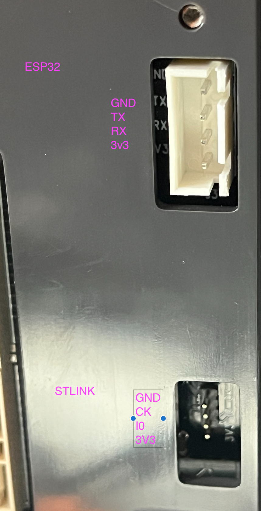
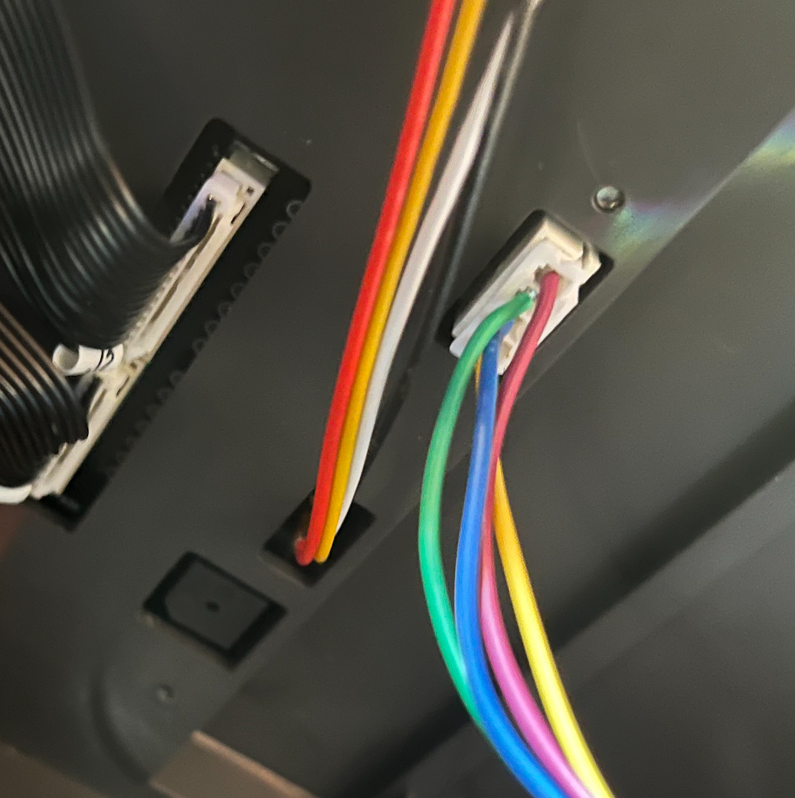
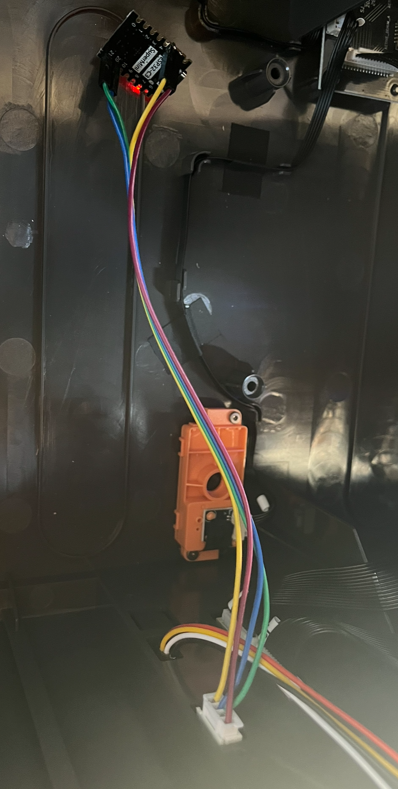

# Sovol SH03 — firmware reconstruction

Firmware reconstruction for the SH03 V3.5.1 filament dryer from an internal flash dump.
Includes editable C application and driver sources, system startup, FreeRTOS,
material profiles, documentation, and source-only emulation tests.
The firmware has not been fully validated for safe operation on physical hardware.

## Original reconstruction

[reconstruction](reconstruction/README.md) contains the original reconstruction
of the SH03 firmware, including buildable sources, recovered control logic,
hardware documentation, and tests against the original firmware. It serves as
the baseline for the custom variant.

## Custom functionality

[custom-functionality](custom-functionality/README.md) builds on the reconstruction
with additional features:

- **ESP32 UART communication:** bidirectional communication with an ESP32-C3 for
  monitoring and controlling both drying chambers from Home Assistant.
- **OTA firmware updates:** update the dryer over Wi-Fi through the ESP32, with
  a bootloader and recovery after an interrupted installation. Initial installation
  requires ST-Link; see the [OTA guide](custom-functionality/docs/ota.md).
- **Display control:** switch both displays and their backlight off or on without
  interrupting drying. The first touch wakes the displays.
- **ESPHome configuration:** a ready-to-use
  [YAML configuration](custom-functionality/esphome/sh03.yaml) with UART communication,
  telemetry, and Home Assistant controls.

**Startup delay with OTA:** the bootloader waits approximately 10 seconds after
power-on to allow the ESP32 to start and request OTA recovery. The dryer does
not start immediately; its application, display, and startup beep begin after
this waiting period.

## Repository scope

This repository contains the reconstructed source project and custom features.

The original firmware binaries are not included in this project. The firmware
source is a reconstruction of the control logic, with custom features added on
top; it is not the manufacturer's original source code. Bundled FreeRTOS retains
its upstream license.

## License

Original contributions by this project's authors are licensed under the
[MIT License](LICENSE), to the extent the authors hold the relevant rights.

Third-party material retains its existing licenses and copyright notices.
Bundled FreeRTOS is covered by its upstream MIT license in
[reconstruction](reconstruction/vendor/FreeRTOS-Kernel/LICENSE.md) and
[custom-functionality](custom-functionality/vendor/FreeRTOS-Kernel/LICENSE.md).

The project's MIT license does not grant rights to Sovol's original firmware
or any manufacturer-owned material reflected in the reconstruction. It does
not establish permission to redistribute such material.

## Disclaimer — use entirely at your own risk

This is an unofficial, experimental project. It is not affiliated with, approved
by, or supported by Sovol. Sovol has stated that flashing custom firmware voids
the manufacturer's warranty. Do not proceed unless you accept that you could permanently damage
or destroy the entire dryer and any connected equipment.

**The entire firmware reconstruction was performed with the help of AI.** The
analysis, reconstructed code, custom features, and documentation may contain
errors, including defects in temperature control and safety behavior. Successful
builds and automated tests do not establish that the firmware is safe. Faults
may cause uncontrolled heating, fire, electric shock, serious injury, or property
damage. Never leave a modified dryer operating unattended.

Everything is provided **as is, without warranty of any kind**. You perform all
modifications and use the firmware entirely at your own risk. To the extent
permitted by applicable law, the author and contributors accept no liability
for damage, loss, injury, or other consequences arising from this project.
If you cannot safely work with mains-powered equipment and embedded electronics,
do not perform this modification.

## Installation guide

You will need an ST-Link programmer, an ESP32-C3 Super Mini, suitable wiring,
and a computer with Git, Python 3, Make, an ARM GNU toolchain
(`arm-none-eabi-gcc`), and the [stlink tools](https://github.com/stlink-org/stlink).
The examples below use a macOS/Linux shell and run from the **repository root**.
They install the custom firmware with OTA support.

### 1. Open the dryer

Unplug the dryer from mains, let it cool, and follow the
[Sovol disassembly video](https://www.youtube.com/watch?v=bVuBhBvCp6w).
Disconnect power before attaching or changing any wiring. Do not work on exposed
mains circuitry while it is energized.

The supplied photo shows the UART connector above the SWD programming header.
Pin order in the tables below follows the photo **from top to bottom**; verify
the labels and orientation on your own board, as revisions may differ.



### 2. Connect ST-Link

Use the lower header marked **STLINK** in the photo:

| Dryer header | ST-Link connection |
| --- | --- |
| GND | GND |
| CK | SWCLK |
| IO | SWDIO |
| 3V3 | Target voltage reference (VTref), if supported by your probe |

Check the pinout of your specific ST-Link rather than relying on connector
position or wire color. **VTref is a voltage-sense input, not a power supply.**
Some probes instead expose a 3.3 V power output; do not connect that output to
an already powered dryer. Use a verified, isolated low-voltage power arrangement
for the control board while programming, with mains disconnected. Do not assume
that the probe can power the entire board. Disconnect the ESP32 during this step.

With the target correctly powered and ST-Link connected to USB, inspect it:

```sh
st-info --probe
```

The expected target profile is `F1xx_HD`, chip ID `0x414`, **256 KiB flash and
64 KiB RAM**. Stop if the detected hardware differs; the OTA layout assumes
this profile.

### 3. Build and flash the dryer firmware

First save your own original flash backup. Run these commands in the same shell
and retain the backup outside the repository as well:

```sh
backup_dir="local-flash-backups/$(date +%Y%m%d-%H%M%S)-before-install"
mkdir -p "$backup_dir"
st-flash read "$backup_dir/original-flash.bin" 0x08000000 0x40000
st-flash read "$backup_dir/original-flash-check.bin" 0x08000000 0x40000
cmp "$backup_dir/original-flash.bin" "$backup_dir/original-flash-check.bin"
```

Continue only if both reads succeed and `cmp` reports no differences (exit status
0, no output). This saves internal flash, not option bytes or a complete image
of every component in the dryer. Local backups are ignored by Git.

Build the bootloader, application, and initial installation image:

```sh
make -C custom-functionality ota CROSS_COMPILE=arm-none-eabi-
```

If using the default PlatformIO ARM toolchain path, omit `CROSS_COMPILE`.
The two main outputs are:

| File | Purpose |
| --- | --- |
| `custom-functionality/build/ota/factory.bin` | Initial ST-Link installation: bootloader, application, and manifest; 256 KiB |
| `custom-functionality/build/ota/application.sh03` | Subsequent dryer application updates over Wi-Fi |

Keep heater power disconnected during initial programming and checks. Flash the
factory image at **`0x08000000`**, then read it back and compare:

```sh
st-flash --reset write custom-functionality/build/ota/factory.bin 0x08000000
st-flash read "$backup_dir/factory-readback.bin" 0x08000000 0x40000
cmp custom-functionality/build/ota/factory.bin "$backup_dir/factory-readback.bin"
```

Proceed only after successful programming and an identical readback. Power down
before disconnecting ST-Link. The bootloader normally waits about **10 seconds**
before starting the application, so the display and startup beep are delayed.
Do not flash `build/standalone/firmware.bin` afterward: it would replace the OTA
bootloader. Command reference: [stlink tutorial](https://github.com/stlink-org/stlink/blob/develop/doc/tutorial.md).

### 4. Flash ESPHome to the ESP32

Initially connect the ESP32 to the computer by USB, with **all dryer wiring
disconnected**. Use the complete
[ESPHome configuration](custom-functionality/esphome/sh03.yaml).

```sh
python3 -m venv custom-functionality/.venv
custom-functionality/.venv/bin/pip install -r custom-functionality/esphome/requirements.txt
```

For a new installation, copy
[secrets.example.yaml](custom-functionality/esphome/secrets.example.yaml) to
`custom-functionality/esphome/secrets.yaml` and fill in the Wi-Fi credentials,
API encryption key, and OTA password. Keep an existing `secrets.yaml` rather
than overwriting it. The YAML uses two Wi-Fi entries with a shared password;
adapt them to your network. The example secrets file includes a command to
generate a new API key. Secrets are ignored by Git.

Validate, compile, and upload:

```sh
custom-functionality/.venv/bin/esphome config custom-functionality/esphome/sh03.yaml
custom-functionality/.venv/bin/esphome run custom-functionality/esphome/sh03.yaml
```

Choose the ESP32's **USB serial port** when prompted for the initial upload.
Alternatively, paste the entire YAML into ESPHome Device Builder, supply the
same secrets, and perform its initial USB installation. Confirm that the ESP32
joins Wi-Fi before disconnecting USB. The configured hostname is
`filament-dryer-01.local`; change the substitutions if needed.

### 5. Connect the ESP32 to the dryer

With both devices powered off and USB disconnected, connect the upper UART
connector shown in the pinout photo:

| Dryer connector, top to bottom | ESP32-C3 Super Mini |
| --- | --- |
| GND | GND |
| TX (MCU PC10 / UART4 TX) | GPIO21 / RX |
| RX (MCU PC11 / UART4 RX) | GPIO20 / TX |
| 3V3 | 3V3 supply input, only after verifying the supply and board requirements |

TX and RX cross between devices. The YAML already uses **RX=GPIO21 / TX=GPIO20**.
UART logic is **3.3 V**; never apply 5 V to these signal pins. Before powering
the ESP32 from the dryer, verify the rail's voltage and available current for
ESP32 Wi-Fi operation. Do not feed 3.3 V into the ESP32's 5V pin, or connect USB
power and the dryer's 3.3 V supply simultaneously unless the power paths are
explicitly designed to prevent backfeeding.

The supplied photos show the UART cable and ESP32 placement. Follow the signal
table, not wire colors. Secure and insulate the board and connections; keep them
away from heaters, moving parts, and mains wiring before reassembling the dryer.





After reassembly, power on and add `filament-dryer-01` through the ESPHome
integration in Home Assistant, using the same API encryption key. Check
`UART connected`, readings from both chambers, start/stop, and **Displays enabled**.
Verify heater-off behavior before any supervised heating test. Turning displays
off must not stop drying; the first touch should wake them without triggering
another action.

### 6. Update both firmwares over Wi-Fi

There are **two separate updates**: ESPHome on the ESP32, and the dryer application
on the SH03. Stop both chambers before updating either device. Keep power stable,
run one update at a time, and keep the existing API key and OTA password.

**ESP32 / ESPHome:** use the wireless Install option in ESPHome Device Builder,
or compile and upload from the repository root:

```sh
custom-functionality/.venv/bin/esphome run custom-functionality/esphome/sh03.yaml   --device filament-dryer-01.local
```

Replace the hostname with the ESP32 IP address if necessary. This updates the
ESP32 only. See the [ESPHome CLI documentation](https://esphome.io/guides/cli/).

**SH03 dryer application:** exit panel editing/diagnostics, rebuild the OTA package,
and upload it through the ESP32's encrypted API:

```sh
make -C custom-functionality ota CROSS_COMPILE=arm-none-eabi-
python3 -m venv custom-functionality/.venv-ota
custom-functionality/.venv-ota/bin/pip install -r custom-functionality/tools/requirements-ota.txt
custom-functionality/.venv-ota/bin/python custom-functionality/tools/ota_upload.py   custom-functionality/build/ota/application.sh03   --host filament-dryer-01.local   --secrets custom-functionality/esphome/secrets.yaml
```

Use **`application.sh03`**, never `factory.bin` or a raw `.bin`. The uploader uses
the API encryption key, not the ESP32 OTA password. Wait for confirmation that
the dryer application has restarted and its size and CRC match. Drying does not
resume automatically, and RAM settings return to defaults. The SH03 bootloader
is not updated over OTA; replacing it still requires ST-Link.

For a frozen dryer application, use the same uploader command with `--recover`.
Wait for its confirmation before power-cycling the dryer and ESP32 together;
the ESP32 will hold the bootloader until Wi-Fi returns. See the
[full OTA and recovery guide](custom-functionality/docs/ota.md#interruption-and-recovery)
for interruption handling and recovery limits. Keep ST-Link and your original
backup available if wireless recovery fails.
